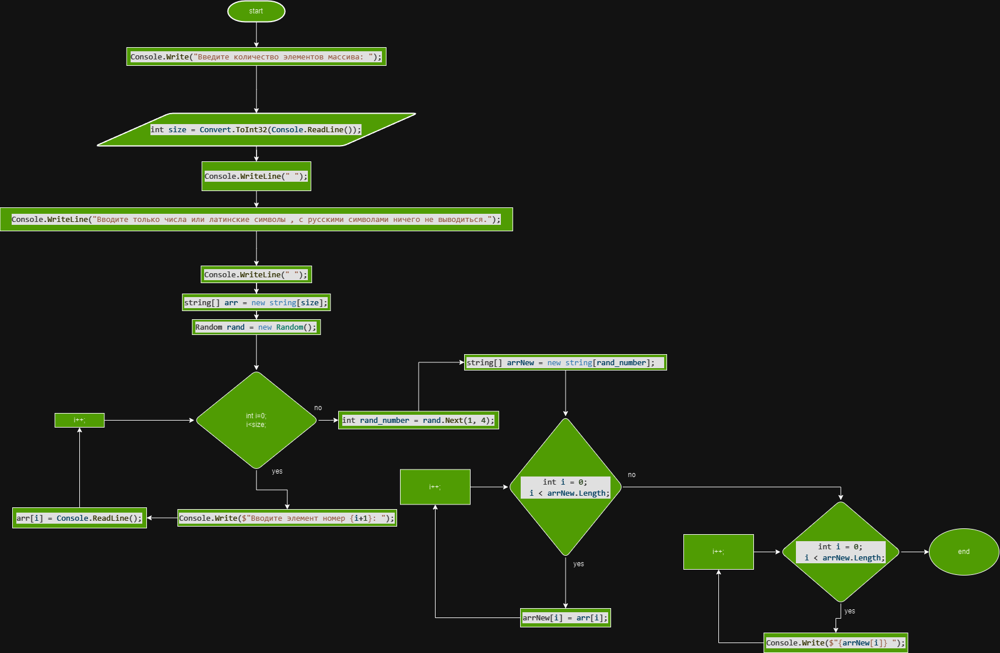

# Контрольная работа

## Описание
Этот проект содержит код на C#, который выполняет следующие действия:

1. Запрашивает у пользователя количество элементов массива.
2. Создает массив строк заданного размера.
3. Запрашивает у пользователя ввод для каждого элемента массива.
4. Создает новый массив случайного размера (от 1 до 4).
5. Заполняет новый массив первыми элементами исходного массива.
6. Выводит элементы нового массива.

